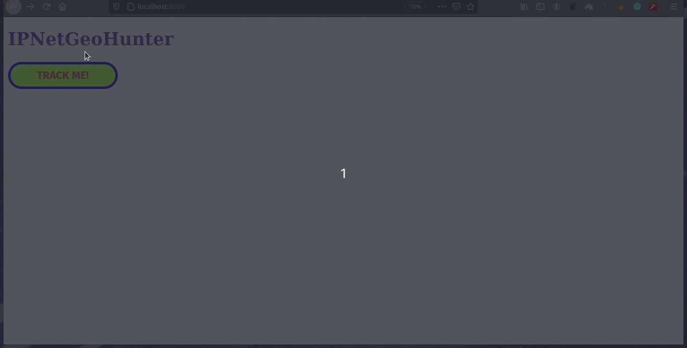

# IPGeoHunter
Geolocation tracker with public IP

**by Subhodeep Sarkar**

This is a Django web application that can track your public IP as well as your current location. Both the things are done using external APIs.
The first API that is used it fetch the public IP is api.ipify.org and then the IP is used as a parameter to further fetch the latitude and longitude of your current
location. Finally this information is used to plot the marker on the map (Openstreetmap).

## Modules and APIs used:
- Django
- Requests
- Folium

## Usage
- Install Django ``pip3 install django``
- Install Folium ``pip3 install folium``
- Start the local development server ``python manage.py runserver``

